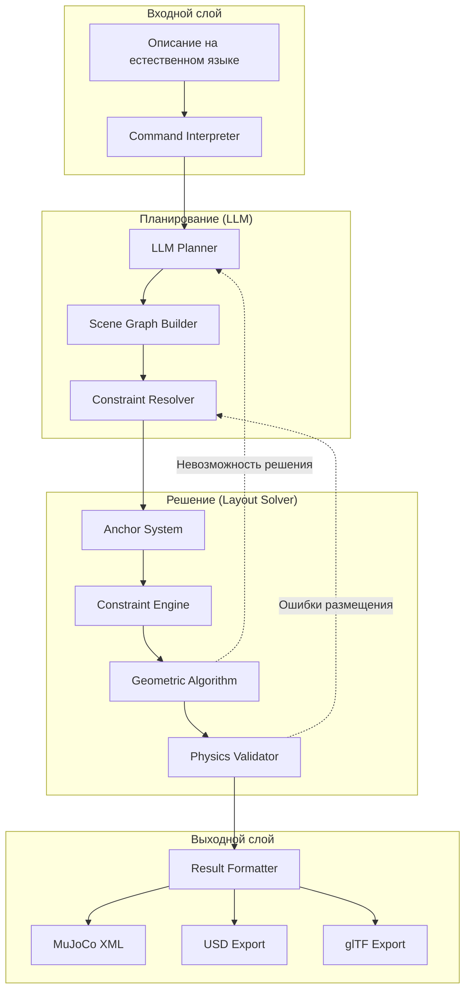

# Дизайн универсальной системы размещения объектов в 3D сценах

## Обзор

Универсальная система размещения объектов представляет собой архитектуру для автоматической генерации реалистичных 3D сцен на основе пользовательских описаний на естественном языке. Система использует иерархический граф сцены с якорной системой позиционирования для обеспечения семантически корректного и физически стабильного размещения объектов.

### Ключевые принципы

1. **Четкое разделение ответственности**: LLM отвечает за семантические отношения и смысловые связи, Layout Solver — за точные геометрические вычисления
2. **Иерархический граф сцены**: Представление объектов и их отношений в виде древовидной структуры с parent-child связями
3. **Якорная система**: Глобальные и локальные якори для стабильного позиционирования объектов
4. **Каскад якорей**: Размещенные объекты автоматически становятся якорями для других объектов
5. **Индивидуальные ограничения**: Каждый объект имеет собственный набор пространственных ограничений вместо групповых шаблонов

### Архитектурные улучшения

По сравнению с существующей системой, новый дизайн включает:

- Формализованную структуру scene graph с явными parent-child отношениями
- Унифицированную якорную систему для всех типов позиционирования
- Поддержку произвольной геометрии комнат (не только прямоугольных)
- Многоуровневое стекирование с автоматической проверкой несущей способности
- Точное позиционирование с поддержкой абсолютных и относительных координат

## Архитектура

### Высокоуровневая архитектура



### Трехэтапная обработка

1. **Этап планирования (LLM)**: Интерпретация естественного языка, создание семантического плана
2. **Этап решения (Layout Solver)**: Геометрические вычисления, размещение объектов
3. **Этап валидации (Physics Validator)**: Проверка физической стабильности и корректировки

## Компоненты и интерфейсы

### 1. Command Interpreter

**Назначение**: Парсинг и интерпретация пространственных команд на естественном языке.

**Интерфейс**:
```python
class CommandInterpreter:
    def parse_spatial_command(self, text: str) -> SpatialCommand:
        """Парсит команду и извлекает пространственные спецификации"""
        
    def extract_precise_constraints(self, command: SpatialCommand) -> List[PreciseConstraint]:
        """Извлекает точные числовые ограничения"""
        
    def classify_positioning_type(self, constraint: str) -> PositioningType:
        """Классифицирует тип позиционирования (точный/приблизительный)"""
```

**Поддерживаемые команды**:
- Точные спецификации: "на расстоянии 1.5м", "под углом 45°"
- Относительные позиции: "справа от", "в углу", "по центру"
- Угловые позиции: "в правом верхнем углу", "в левом нижнем углу"
- Комбинированные команды: "диван по центру стены, справа от него стол на расстоянии 1м"

### 2. LLM Planner

**Назначение**: Создание семантического плана размещения без точных координат.

**Интерфейс**:
```python
class LLMPlanner:
    def create_semantic_plan(self, description: str, room_spec: RoomSpec) -> SemanticPlan:
        """Создает семантический план размещения"""
        
    def resolve_object_relationships(self, objects: List[SceneObject]) -> RelationshipGraph:
        """Определяет семантические отношения между объектами"""
        
    def generate_constraints(self, relationships: RelationshipGraph) -> List[Constraint]:
        """Генерирует пространственные ограничения из отношений"""
```

**Выходные данные**:
- Список объектов с семантическими отношениями
- Пространственные ограничения без координат
- Приоритеты и веса ограничений
- Метаданные о намерениях пользователя

### 3. Scene Graph

**Назначение**: Иерархическое представление сцены с parent-child отношениями.

**Структура данных**:
```python
@dataclass
class SceneNode:
    id: str
    object_type: str
    parent: Optional['SceneNode']
    children: List['SceneNode']
    constraints: List[Constraint]
    anchor_points: List[AnchorPoint]
    metadata: Dict[str, Any]

@dataclass
class SceneGraph:
    root: SceneNode
    global_anchors: List[GlobalAnchor]
    room_geometry: RoomGeometry
    
    def add_object(self, obj: SceneObject, parent: Optional[SceneNode]) -> SceneNode:
        """Добавляет объект в граф с установкой parent-child связей"""
        
    def get_descendants(self, node: SceneNode) -> List[SceneNode]:
        """Возвращает всех потомков узла"""
        
    def find_anchor_candidates(self, node: SceneNode) -> List[AnchorPoint]:
        """Находит доступные якори для размещения объекта"""
```

### 4. Anchor System

**Назначение**: Управление системой якорей для позиционирования объектов.

**Типы якорей**:

#### Глобальные якори
- **Стены**: north_wall, south_wall, east_wall, west_wall
- **Углы**: corner_nw, corner_ne, corner_sw, corner_se
- **Центральные точки**: room_center, wall_centers
- **Архитектурные элементы**: door_frame, window_frame

#### Локальные якори
- **Поверхности объектов**: table_top, shelf_surface
- **Края объектов**: table_edge_front, sofa_side_left
- **Функциональные точки**: chair_seat_center, lamp_base

**Интерфейс**:
```python
class AnchorSystem:
    def create_global_anchors(self, room: RoomGeometry) -> List[GlobalAnchor]:
        """Создает глобальные якори на основе геометрии комнаты"""
        
    def create_local_anchors(self, obj: PlacedObject) -> List[LocalAnchor]:
        """Создает локальные якори для размещенного объекта"""
        
    def find_best_anchor(self, constraints: List[Constraint]) -> Optional[AnchorPoint]:
        """Находит оптимальный якорь для набора ограничений"""
        
    def cascade_anchors(self, placed_objects: List[PlacedObject]) -> None:
        """Обновляет систему якорей после размещения объектов"""
```

### 5. Constraint Engine

**Назначение**: Обработка и решение пространственных ограничений.

**Типы ограничений**:

#### Позиционные ограничения
- **distance**: Ограничения расстояния между объектами
- **alignment**: Выравнивание по осям или плоскостям
- **facing**: Ориентация объектов друг к другу
- **containment**: Размещение внутри границ

#### Геометрические ограничения
- **collision_avoidance**: Предотвращение пересечений
- **support**: Проверка несущей способности
- **accessibility**: Обеспечение доступности
- **clearance**: Минимальные зазоры

**Интерфейс**:
```python
class ConstraintEngine:
    def add_constraint(self, constraint: Constraint) -> None:
        """Добавляет ограничение в систему"""
        
    def solve_constraints(self, objects: List[SceneObject]) -> ConstraintSolution:
        """Решает систему ограничений"""
        
    def validate_solution(self, solution: ConstraintSolution) -> ValidationResult:
        """Проверяет корректность решения"""
        
    def resolve_conflicts(self, conflicts: List[ConstraintConflict]) -> Resolution:
        """Разрешает конфликты между ограничениями"""
```

### 6. Layout Solver

**Назначение**: Вычисление точных координат объектов на основе ограничений.

**Алгоритмы размещения**:

#### Адаптивный выбор алгоритма
```python
class LayoutSolver:
    def choose_algorithm(self, scene_complexity: SceneComplexity) -> PlacementAlgorithm:
        """Выбирает оптимальный алгоритм на основе сложности сцены"""
        
    def solve_placement(self, scene_graph: SceneGraph) -> PlacementSolution:
        """Решает задачу размещения объектов"""
```

#### DFS + Beam Search (для простых сцен)
- Количество объектов: < 20
- Количество ограничений: < 50
- Время выполнения: O(n²)

#### MILP (для сложных сцен)
- Количество объектов: > 20
- Сложные взаимозависимости ограничений
- Время выполнения: O(n³) но с гарантией оптимальности

### 7. Physics Validator

**Назначение**: Проверка физической стабильности размещения.

**Проверки**:
- Коллизии между объектами (OBB + SAT)
- Стабильность стекирования
- Несущая способность поверхностей
- Центр масс и равновесие

**Интерфейс**:
```python
class PhysicsValidator:
    def check_collisions(self, objects: List[PlacedObject]) -> List[Collision]:
        """Проверяет пересечения между объектами"""
        
    def validate_stacking(self, stack: List[PlacedObject]) -> StackingResult:
        """Проверяет стабильность стекирования"""
        
    def check_support_capacity(self, supporter: PlacedObject, supported: List[PlacedObject]) -> bool:
        """Проверяет несущую способность"""
```

## Модели данных

### Основные структуры данных

```python
@dataclass
class RoomGeometry:
    """Геометрия комнаты произвольной формы"""
    boundary_polygon: List[Vec2]  # Внешняя граница
    holes: List[List[Vec2]]       # Внутренние вырезы
    wall_height: float
    architectural_elements: List[ArchElement]
    
@dataclass
class AnchorPoint:
    """Точка якоря для позиционирования"""
    id: str
    position: Vec3
    orientation: Quaternion
    anchor_type: AnchorType
    availability: bool
    constraints: List[str]  # Ограничения на использование
    
@dataclass
class Constraint:
    """Пространственное ограничение"""
    id: str
    constraint_type: ConstraintType
    source_object: str
    target_object: Optional[str]
    parameters: Dict[str, Any]
    priority: float
    is_hard: bool  # Жесткое или мягкое ограничение
    
@dataclass
class PlacedObject:
    """Размещенный объект с координатами"""
    id: str
    model_name: str
    position: Vec3
    orientation: Quaternion
    bounding_box: OBB
    anchor_points: List[AnchorPoint]
    physics_properties: PhysicsProperties
```

### Расширенные ограничения

```python
class DistanceConstraint(Constraint):
    """Ограничение расстояния"""
    min_distance: float
    max_distance: float
    measurement_type: DistanceMeasurement  # center_to_center, edge_to_edge, etc.
    
class AlignmentConstraint(Constraint):
    """Ограничение выравнивания"""
    alignment_axis: Axis  # X, Y, Z
    alignment_type: AlignmentType  # center, edge, face
    tolerance: float
    
class FacingConstraint(Constraint):
    """Ограничение ориентации"""
    facing_direction: Vec3
    angle_tolerance: float
    facing_type: FacingType  # towards, away_from, parallel
```

## Correctness Properties

*Свойство корректности — это характеристика или поведение, которое должно выполняться во всех допустимых состояниях системы. Свойства служат мостом между человекочитаемыми спецификациями и машинно-проверяемыми гарантиями корректности.*

### Property Reflection

После анализа критериев приемки выявлены следующие группы свойств:

**Группа 1: Структурная целостность графа сцены**
- Свойства 1.2, 1.4, 1.5 все проверяют корректность структуры графа
- Можно объединить в одно комплексное свойство о целостности графа

**Группа 2: Система якорей**
- Свойства 2.3, 2.4 проверяют создание и каскадирование якорей
- Можно объединить в свойство о каскадной системе якорей

**Группа 3: Разделение ответственности**
- Свойства 4.3, 4.4 проверяют разделение между LLM и Solver
- Можно объединить в свойство о корректности интерфейса

**Группа 4: Физическая корректность**
- Свойства 15.1, 15.3 проверяют физическую валидность
- Можно объединить в одно свойство о физической корректности

**Группа 5: Стекирование**
- Свойства 7.1, 7.2, 7.3, 7.4 все относятся к стекированию
- Можно объединить в комплексное свойство о корректности стекирования

После рефлексии остаются следующие уникальные свойства:

### Property 1: Целостность иерархического графа сцены

*Для любого* объекта, добавленного в Scene_Graph, граф должен сохранять структурную целостность: parent-child связи должны быть двунаправленными, запрос потомков должен возвращать полное поддерево, и все семантические отношения должны сохраняться без изменений.

**Validates: Requirements 1.2, 1.4, 1.5**

### Property 2: Каскадная система якорей

*Для любого* размещенного объекта, система якорей должна автоматически создавать локальные якори, которые становятся доступными для последующих объектов, и при удалении якоря все зависимые объекты должны быть корректно переназначены на альтернативные якори.

**Validates: Requirements 2.3, 2.4, 2.5**

### Property 3: Разделение ответственности LLM и Solver

*Для любого* пользовательского описания, LLM_Planner должен генерировать семантический план без координат, а Layout_Solver должен принимать этот план и выдавать точные позиции объектов, при этом точные пользовательские спецификации должны передаваться как жесткие ограничения.

**Validates: Requirements 4.3, 4.4, 4.7**

### Property 4: Приоритетное разрешение конфликтов ограничений

*Для любого* набора конфликтующих ограничений, Constraint_Engine должен применять систему приоритетов детерминированно и консистентно, так что одинаковые конфликты всегда разрешаются одинаково.

**Validates: Requirements 5.6**

### Property 5: Корректность многоуровневого стекирования

*Для любого* количества уровней стекирования, Layout_Solver должен корректно определять поддерживающие поверхности, проверять несущую способность каждого уровня, и Physics_Validator должен валидировать стабильность всей конструкции.

**Validates: Requirements 7.1, 7.2, 7.3, 7.4**

### Property 6: Предоставление альтернатив при невозможности размещения

*Для любого* случая невозможности размещения объекта, Layout_Solver должен предоставлять список альтернативных позиций, удовлетворяющих максимальному количеству ограничений.

**Validates: Requirements 9.1**

### Property 7: Валидация и преобразование семантических планов

*Для любого* JSON-плана от LLM, Parser должен валидировать структуру и корректно преобразовывать семантические отношения в геометрические ограничения, сохраняя все семантические связи.

**Validates: Requirements 10.1, 10.2**

### Property 8: Отсутствие коллизий в размещенной сцене

*Для любой* сгенерированной сцены, между объектами не должно быть пересечений (с учетом допустимых зазоров), все заданные ограничения должны быть соблюдены, и физическая стабильность должна быть гарантирована.

**Validates: Requirements 15.1, 15.2, 15.3**

### Property 9: Семантическая корректность сцены

*Для любой* сгенерированной сцены, семантические отношения между объектами должны соответствовать исходному описанию: объекты "на" поверхностях должны находиться на них, объекты "рядом" должны быть в заданном диапазоне расстояний, и т.д.

**Validates: Requirements 15.4**

### Property 10: Round-trip сохранение сцены

*Для любой* сгенерированной сцены, последовательность операций parse → place → serialize → parse → place должна давать эквивалентный результат с точностью до численной погрешности.

**Validates: Requirements 15.5**

## Обработка ошибок

### Стратегия обработки ошибок

Система использует многоуровневую стратегию обработки ошибок:

#### Уровень 1: Валидация входных данных
- **Command Interpreter**: Проверка синтаксиса команд на естественном языке
- **LLM Planner**: Валидация семантической корректности описания
- **Parser**: Проверка структуры JSON-плана

**Действия при ошибке**:
- Возврат детального описания ошибки пользователю
- Предложение исправлений или альтернативных формулировок
- Логирование для анализа паттернов ошибок

#### Уровень 2: Разрешение конфликтов ограничений
- **Constraint Engine**: Обнаружение конфликтующих ограничений
- **Priority System**: Применение весов и приоритетов
- **Conflict Resolver**: Автоматическое разрешение или эскалация

**Действия при конфликте**:
- Применение системы приоритетов (жесткие > мягкие)
- Использование весовых коэффициентов для мягких ограничений
- Если конфликт неразрешим: возврат к LLM Planner для корректировки

#### Уровень 3: Невозможность геометрического размещения
- **Layout Solver**: Обнаружение невозможности размещения
- **Alternative Generator**: Генерация альтернативных позиций
- **Relaxation Strategy**: Ослабление мягких ограничений

**Действия при невозможности размещения**:
1. Попытка найти альтернативные позиции с ослабленными мягкими ограничениями
2. Генерация списка частичных решений с указанием нарушенных ограничений
3. Возврат к LLM Planner с описанием проблемы для пересмотра плана
4. В крайнем случае: уведомление пользователя о невозможности размещения

#### Уровень 4: Физическая нестабильность
- **Physics Validator**: Обнаружение нестабильных конфигураций
- **Stability Analyzer**: Анализ причин нестабильности
- **Repair System**: Автоматическое исправление

**Действия при нестабильности**:
1. Gradient-based overlap resolution для устранения пересечений
2. Локальная корректировка позиций с сохранением ограничений
3. Перерасчет стекирования с учетом центра масс
4. Если исправление невозможно: откат к предыдущему стабильному состоянию

### Система восстановления

```python
class ErrorRecoverySystem:
    def handle_placement_failure(
        self, 
        failed_object: SceneObject,
        reason: FailureReason,
        context: PlacementContext
    ) -> RecoveryAction:
        """Определяет стратегию восстановления после ошибки размещения"""
        
    def generate_alternatives(
        self,
        object: SceneObject,
        constraints: List[Constraint],
        max_alternatives: int = 5
    ) -> List[AlternativePlacement]:
        """Генерирует альтернативные варианты размещения"""
        
    def relax_constraints(
        self,
        constraints: List[Constraint],
        relaxation_strategy: RelaxationStrategy
    ) -> List[Constraint]:
        """Ослабляет мягкие ограничения для поиска решения"""
        
    def rollback_to_stable_state(
        self,
        scene_graph: SceneGraph,
        checkpoint: StateCheckpoint
    ) -> SceneGraph:
        """Откатывает граф сцены к предыдущему стабильному состоянию"""
```

### Логирование и диагностика

Система ведет подробное логирование для анализа и отладки:

```python
@dataclass
class PlacementLog:
    timestamp: datetime
    object_id: str
    attempted_positions: List[Vec3]
    constraint_scores: Dict[str, float]
    failure_reason: Optional[str]
    recovery_action: Optional[str]
    final_position: Optional[Vec3]
```

**Уровни логирования**:
- **DEBUG**: Все кандидаты размещения и их оценки
- **INFO**: Успешные размещения и основные решения
- **WARNING**: Конфликты ограничений и ослабления
- **ERROR**: Невозможность размещения и откаты

## Стратегия тестирования

### Подход к тестированию

Система использует комбинированный подход к тестированию:

#### 1. Property-Based Testing (PBT)

**Применимость**: PBT применяется для тестирования универсальных свойств системы, которые должны выполняться для любых входных данных.

**Библиотека**: Hypothesis (Python)

**Конфигурация**:
- Минимум 100 итераций на свойство
- Генераторы для случайных сцен, объектов, ограничений
- Shrinking для минимизации контрпримеров

**Тестируемые свойства**:

```python
# Property 1: Целостность графа сцены
@given(scene_objects=st.lists(st.scene_objects(), min_size=1, max_size=20))
def test_scene_graph_integrity(scene_objects):
    """Feature: universal-scene-placement-system, Property 1: 
    Для любого объекта в графе, parent-child связи двунаправлены"""
    graph = SceneGraph()
    for obj in scene_objects:
        node = graph.add_object(obj, parent=random.choice(graph.nodes))
        assert node.parent is None or node in node.parent.children
        assert all(child.parent == node for child in node.children)

# Property 2: Каскадная система якорей
@given(placed_objects=st.lists(st.placed_objects(), min_size=2, max_size=10))
def test_anchor_cascade(placed_objects):
    """Feature: universal-scene-placement-system, Property 2:
    Размещенные объекты автоматически становятся якорями"""
    anchor_system = AnchorSystem()
    for obj in placed_objects:
        initial_anchor_count = len(anchor_system.get_available_anchors())
        anchor_system.register_placed_object(obj)
        new_anchor_count = len(anchor_system.get_available_anchors())
        assert new_anchor_count > initial_anchor_count

# Property 8: Отсутствие коллизий
@given(scene=st.valid_scenes())
def test_no_collisions(scene):
    """Feature: universal-scene-placement-system, Property 8:
    В размещенной сцене нет пересечений объектов"""
    placed_objects = scene.get_all_placed_objects()
    for i, obj_a in enumerate(placed_objects):
        for obj_b in placed_objects[i+1:]:
            assert not obb_overlap(obj_a.bounding_box, obj_b.bounding_box, margin=0.01)

# Property 10: Round-trip сохранение
@given(scene=st.valid_scenes())
def test_round_trip_preservation(scene):
    """Feature: universal-scene-placement-system, Property 10:
    Parse → place → serialize → parse → place дает эквивалентный результат"""
    # Первый проход
    plan1 = scene.to_semantic_plan()
    placed1 = layout_solver.solve_placement(plan1)
    serialized = formatter.serialize(placed1)
    
    # Второй проход
    plan2 = parser.parse(serialized)
    placed2 = layout_solver.solve_placement(plan2)
    
    # Проверка эквивалентности (с учетом численной погрешности)
    assert scenes_equivalent(placed1, placed2, tolerance=1e-3)
```

#### 2. Unit Testing

**Применимость**: Для тестирования конкретных функций, специфических сценариев и граничных случаев.

**Фреймворк**: pytest

**Покрытие**:
- Конкретные типы ограничений (distance, alignment, facing)
- Специфические геометрии комнат (L-образные, с препятствиями)
- Граничные случаи (пустая сцена, один объект, максимальная плотность)
- Обработка ошибок и восстановление

```python
def test_distance_constraint_near():
    """Тест ограничения расстояния 'near'"""
    table = create_object("table", position=(0, 0, 0))
    chair = create_object("chair", position=(0.5, 0, 0))
    constraint = DistanceConstraint(
        source=chair, target=table,
        min_distance=0.2, max_distance=0.8
    )
    assert constraint.is_satisfied()

def test_l_shaped_room_placement():
    """Тест размещения в L-образной комнате"""
    room = create_l_shaped_room(width=5, height=5, cutout_size=2)
    objects = [create_object("table"), create_object("chair")]
    solver = LayoutSolver()
    result = solver.solve_placement(objects, room)
    assert result.success
    assert all(obj.position_inside_room(room) for obj in result.placed_objects)

def test_impossible_placement_recovery():
    """Тест восстановления при невозможности размещения"""
    room = create_room(size=2)  # Очень маленькая комната
    large_objects = [create_object("sofa", size=(3, 1, 1)) for _ in range(5)]
    solver = LayoutSolver()
    result = solver.solve_placement(large_objects, room)
    assert not result.success
    assert len(result.alternatives) > 0
    assert result.failure_reason is not None
```

#### 3. Integration Testing

**Применимость**: Для тестирования взаимодействия между компонентами системы.

**Сценарии**:
- End-to-end: от текстового описания до MuJoCo XML
- LLM Planner → Layout Solver → Physics Validator
- Обработка ошибок между компонентами
- Экспорт в различные форматы (MuJoCo, USD, glTF)

```python
def test_end_to_end_scene_generation():
    """Интеграционный тест полного пайплайна"""
    description = "Комната с столом в центре и четырьмя стульями вокруг него"
    
    # Планирование
    semantic_plan = llm_planner.create_semantic_plan(description, room_spec)
    assert semantic_plan.objects
    
    # Размещение
    placement_result = layout_solver.solve_placement(semantic_plan)
    assert placement_result.success
    
    # Валидация
    validation_result = physics_validator.validate(placement_result.scene)
    assert validation_result.is_stable
    
    # Экспорт
    mujoco_xml = formatter.to_mujoco_xml(placement_result.scene)
    assert mujoco_xml is not None
    assert validate_mujoco_xml(mujoco_xml)
```

#### 4. Performance Testing

**Метрики**:
- Время размещения в зависимости от количества объектов
- Использование памяти для больших сцен
- Скорость сходимости алгоритмов оптимизации

```python
@pytest.mark.benchmark
def test_placement_performance_scaling():
    """Тест масштабируемости размещения"""
    for n_objects in [5, 10, 20, 50, 100]:
        objects = [create_random_object() for _ in range(n_objects)]
        start_time = time.time()
        result = layout_solver.solve_placement(objects, room)
        elapsed = time.time() - start_time
        
        # Ожидаем субквадратичную сложность
        assert elapsed < n_objects * 0.1  # 100ms на объект
```

### Стратегия тестирования по компонентам

| Компонент | PBT | Unit | Integration | Performance |
|-----------|-----|------|-------------|-------------|
| Scene Graph | ✓ | ✓ | - | - |
| Anchor System | ✓ | ✓ | - | - |
| Constraint Engine | ✓ | ✓ | ✓ | - |
| Layout Solver | ✓ | ✓ | ✓ | ✓ |
| Physics Validator | ✓ | ✓ | ✓ | - |
| LLM Planner | - | ✓ | ✓ | - |
| Parser/Formatter | ✓ | ✓ | ✓ | - |

### Continuous Integration

**CI Pipeline**:
1. Lint и type checking (mypy, flake8)
2. Unit tests (быстрые, < 1 минуты)
3. Property-based tests (средние, < 5 минут)
4. Integration tests (медленные, < 10 минут)
5. Performance benchmarks (по расписанию)

**Coverage Target**: 85% для критических компонентов (Layout Solver, Constraint Engine, Physics Validator)

## Заключение

Универсальная система размещения объектов представляет собой комплексное решение для автоматической генерации 3D сцен с четким разделением ответственности между семантическим планированием (LLM) и геометрическими вычислениями (Layout Solver). 

Ключевые преимущества дизайна:

1. **Модульность**: Четкое разделение компонентов позволяет независимо развивать и тестировать каждый модуль
2. **Расширяемость**: Система ограничений и якорей легко расширяется новыми типами
3. **Надежность**: Многоуровневая обработка ошибок и система восстановления обеспечивают стабильную работу
4. **Тестируемость**: Комбинация PBT и unit-тестов обеспечивает высокое покрытие и уверенность в корректности
5. **Производительность**: Адаптивный выбор алгоритмов оптимизирует время выполнения для сцен разной сложности

Система готова к реализации с использованием существующего кода в `creator/placement/` в качестве основы, с добавлением новых компонентов для поддержки иерархического графа сцены, расширенной системы якорей и улучшенной обработки ошибок.
